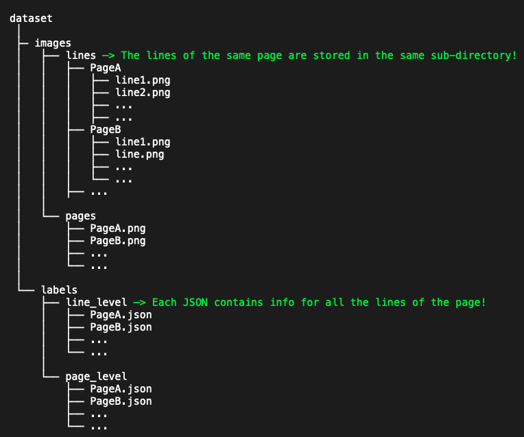

# 🐋 whale-spectrogram-dataset-tools

A PyTorch-based toolkit for loading, processing, visualizing, and evaluating Humpback Whale song spectrograms. This repository serves as supplementary material to the Humpback Whales Spectrogram Dataset. The dataset, as well as the data descriptor (paper) are yet to be published. 

## 📂 Project Structure

- `src/whales_dataset.py`: Custom PyTorch `Dataset` classes (`LineLevelDataset`, `PageLevelDataset`) that handle complex JSON annotations.
- `src/transforms.py`: Specialized operations on the data, including patches creation (`RandomSpectrogramLinePatcher`) and format converters (`UnitIntervalsToYOLO`).
- `src/evaluate.py`: Evaluation script to calculate Precision, Recall, and mAP for object detection.
- `src/visualization.py`: Script for visualizing bounding boxes/polygons.
- `src/utils.py`: General helper functions (e.g. `is_valid_file`) and parsers (e.g. `parse_line_level_data`).

## 🚀 Installation
### Clone the repository:
   ```bash
   git clone https://github.com/g-matidis/whale-spectrogram-dataset-tools.git
   cd whale-spectrogram-dataset-tools
   ```

### Set up this project using the modern `uv` manager (recommended) or the traditional `pip`.
* ### Option A: Using `uv` (recommended).
1. Install **uv** from https://astral.sh/uv.
2. Install dependencies:
   ```bash 
   uv sync
   ```

* ### Option 2: Using `pip`.
1. Create and activate your virtual environment:
   ```bash
   python -m venv .your_env_name
   source .your_env_name/bin/activate
   ```
2. Install dependencies:
   ```bash
   pip install -r requirements.txt --extra-index-url https://download.pytorch.org/whl/cu124
   ```
3. Link project's source code to the environment:
   ```bash
   pip install -e .
   ```

## 📥 Download the Dataset
NOTE: The full dataset is not published yet! For now, you can test and explore the project's tools on the [sample data](./data/samples/) (comes with "git clone").

The data must be organized as follows:


## Visualize the data
The dataset images with drawn annotations can be visualized and saved in a directory, for further inspection. As an example, we provide indicative CLI commands to visualize the data of the [samples](./data/samples/), for line-level and page-level respectively:

- Visualize lines:
   ```bash
   uv run python -m whale_spectrogram_dataset_tools.visualization \
   --level line \
   --images_dir data/samples/images/lines/ \
   --labels_dir data/samples/labels/line_level/ \
   --output_dir data/samples/visualized_data/lines
   ```

- Visualize pages:
   ```bash
   uv run python -m whale_spectrogram_dataset_tools.visualization \
   --level page \
   --images_dir data/samples/images/pages/ \
   --labels_dir data/samples/labels/page_level/ \
   --output_dir data/samples/visualized_data/pages
   ```

If you do not work with `uv', you can just run the commands above by simply skipping "uv run" in the beginning of each command.
